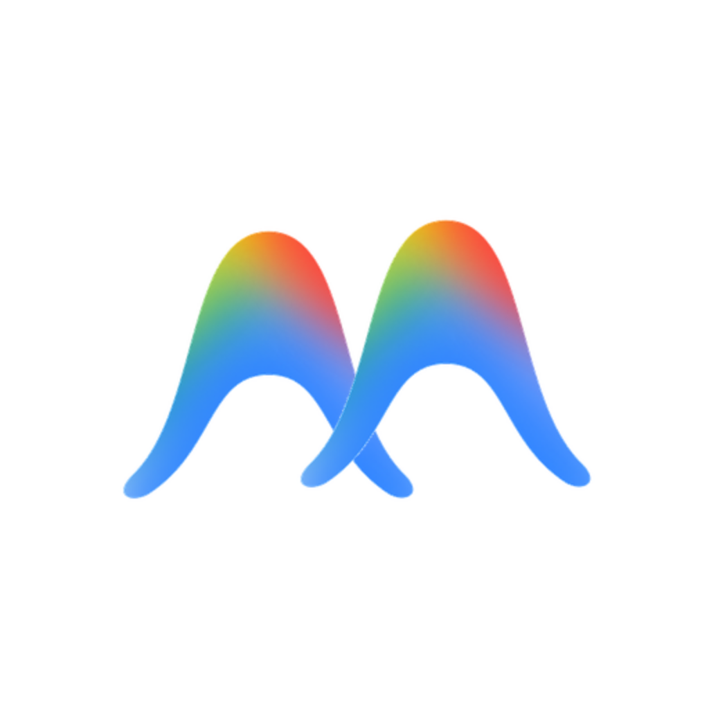

# AntiGravity Switch



[简体中文](README.zh-CN.md) · [Download](https://github.com/anglee0323/agy-switch/releases/latest) · [CLI guide](docs/cli.md)

Manage Antigravity accounts, check remaining quotas, and review local token usage from a desktop app or terminal. agy-switch connects directly to Google for authorization and quota requests. Account data and usage records stay on your machine.

## Choose how to use it

| Platform | Desktop | Quick access | Terminal |
| --- | --- | --- | --- |
| macOS · Apple Silicon | Application bundle | Native menu bar | `agy-switch`, included with Homebrew |
| Windows · x64 | Per-user installer | Tray dashboard | Console `agy-switch.exe`, included in the installer or available separately |
| Linux · x64 | Debian package, Ubuntu 22.04 build baseline | Tray dashboard where the desktop supports it | `agy-switch`, included in the deb or available separately |

The desktop app and CLI share the same accounts. Linux supports desktop use as well as terminal commands without a display. The Linux CLI currently still needs GTK3/WebKitGTK runtime libraries; it is not a static server binary. Intel macOS, Windows ARM and Linux ARM packages are not provided.

## Install

**4.9.0 release candidate:** AntiGravity Switch uses the `agy-switch` repository, package and command names, with the selected twin-wave icon. This version adds CLI policy editing, account ordering and update checks. Release publication and the matching Homebrew recipe follow platform acceptance; use the Releases page to confirm availability. Historical downloads retain their original names and checksums.

Download the package for your platform from **[GitHub Releases](https://github.com/anglee0323/agy-switch/releases/latest)**. Desktop and CLI downloads include SHA-256 checksum files. Updater packages have cryptographic signatures, and `release-manifest.json` records every asset and its source commit.

### macOS

```sh
brew tap anglee0323/agy-switch https://github.com/anglee0323/agy-switch.git
brew install --cask anglee0323/agy-switch/agy-switch
```

This installs the app and `agy-switch`. For a manual installation, unpack `agy-switch-<version>-macos-arm64.zip` and move the app to Applications. See the [Homebrew guide](docs/homebrew.md) for upgrades and validation.

### Windows

Run `agy-switch-<version>-windows-x64-setup.exe`. The installer includes English and Simplified Chinese and installs for the current user. It includes the console CLI next to the desktop executable.

For terminal use alone, extract `agy-switch-<version>-windows-x64.zip`, open PowerShell in that folder, and run:

```powershell
.\agy-switch.exe
.\agy-switch.exe accounts list --json
```

PowerShell waits for this console executable and preserves its exit code. See [Windows setup](docs/windows.md) for paths, runtime requirements and troubleshooting.

### Linux

```sh
sudo apt install ./agy-switch-<version>-linux-amd64.deb
agy-switch-desktop       # desktop app
agy-switch              # terminal dashboard
```

For terminal use alone, use `agy-switch-<version>-linux-amd64.tar.gz`. The [Linux guide](docs/linux.md) covers runtime libraries, installation without a display, Secret Service and desktop compatibility.

**Package trust:** macOS packages currently lack Developer ID signing/notarization, and Windows packages lack Authenticode signing. System trust checks may block them. Homebrew does not bypass those checks. See [4.8.1 distribution validation](docs/4.8.1-public-acceptance.md) for the observed Mac launch restriction; file integrity and trusted distribution are separate checks.

## Get started

1. Open the app and add an account through Google authorization, a refresh token, or import from this machine. The terminal dashboard also supports authorization and masked token entry.
2. Refresh quotas, then choose the account you want to use. A switch may close and reopen Antigravity; save work first and verify the selected account in the client afterward.
3. Check usage on the home page or in the menu bar/tray. Enable smart switching in Settings if you want automatic backup-account selection.

`agy-switch` is the management command; run it without arguments for the terminal dashboard. Google’s `agy` runs Antigravity tasks. A switch synchronizes an initialized native `agy` session along with the Antigravity app; an already running task can retain its previous credentials.

## What you can do

| Area | Features |
| --- | --- |
| Accounts | Quotas and reset times, table/card views, remarks, enable/disable, ordering and batch actions |
| Usage | Daily and recent usage, input/output/cache breakdown, per-model cost estimates and distribution chart |
| Quick dashboard | Today’s usage, aggregate remaining quotas, per-account quotas and explicit switch buttons |
| Smart switching | Priority or round robin, draggable candidate order, quota thresholds and activity checks; off by default |
| Updates | Version checks, signed downloads, installation progress and restart where supported. [Platform limits](docs/software-updates.md) |
| Appearance | Simplified Chinese/English, light/dark themes, model selection and quick-dashboard preferences |

The quick dashboard uses the same three sections across platforms. Mac uses a native system menu; Windows and Linux use an opaque compact window. Choose Gemini, Claude/GPT or both in Settings, along with account naming, unavailable-account visibility and reset countdowns on hover, always or hidden. Quota bars use green above 60%, yellow from 20–60% and red below 20% by default. Percentages remain readable in the normal text color.

Aggregate quotas are equal-weight averages of valid account observations, with available-account counts. They are not a sum of tokens. Missing or stale quota data is shown as unknown. Cost is an estimate based on known model pricing, not an Antigravity bill; unpriced models remain explicit. Smart switching does not migrate running tasks or guarantee that every task has finished. [Switching behavior](docs/low-quota-switching.md) · [Dashboard semantics](docs/menu-bar-dashboard.md)

## Terminal workflow

```sh
agy-switch                       # interactive dashboard
agy-switch accounts list
agy-switch quota                 # cached quotas
agy-switch stats                 # local usage and estimated cost
agy-switch refresh               # fetch current quotas
agy-switch switch user@example.com
agy-switch current --json         # agy-switch’s saved selection
```

Use ↑/↓ to select, Enter/→ to enter, and Esc/← to return. Number shortcuts remain available. Interactive account management includes remarks, enable/disable, confirmed deletion and account addition. Script commands support JSON and documented exit codes. Read commands use cached local data and do not start the desktop app.

Version 4.9.0 adds policy configuration, account/candidate ordering and update checks to the CLI. Desktop preferences, update installation and background policy execution remain desktop features. [Commands, safety and exit codes](docs/cli.md)

## Screenshots and validation


Windows native WebView2 usage dashboard.


Linux native WebKitGTK quick dashboard. Both images come from the documented 4.8.0 CI debug build with synthetic example data and exclude the system window frame. [Image provenance](docs/screenshots/4.8.0/README.md)

Native window tests, terminal tests and package tests are tracked separately. Build success alone does not prove authenticated switching, login startup, tray placement on every monitor or compatibility with every Linux desktop. [Platform acceptance](docs/native-gui-acceptance.md)

## Data and privacy

Accounts and preferences are stored in `~/.antigravity_tools`; `ABV_DATA_DIR` overrides this directory. Imported credentials are sensitive local files. Usage comes from local Antigravity databases and archives; the app does not upload conversation content. Google authorization, token refresh and quota requests use the network. Pricing and optional update checks also use the network.

agy-switch has no project-operated credential relay or proxy service. Account switching changes the credential stores used by the selected client and can report a partial update; inspect the client before retrying after a failure. [CLI behavior and shared switch lock](docs/cli.md)

## Build and contribute

Use Node.js 22+, Rust stable and the platform dependencies listed in the platform guides.

```sh
npm ci
npm run tauri dev
cargo test --locked --manifest-path src-tauri/Cargo.toml --lib
npx playwright test
```

Build a Mac bundle with `npm run tauri build`. On Windows use `./scripts/build-windows.ps1`; on Linux use `./scripts/build-linux-deb.sh --native` or `--docker`. The packaging workflow produces desktop packages and console downloads, verifies their checksums, and publishes only tagged main-branch source. [Release checklist](docs/release-checklist.md)

Derived from [lbjlaq/Antigravity-Manager](https://github.com/lbjlaq/Antigravity-Manager). This fork focuses on local accounts, quotas and usage, with its own CLI, settings and quick dashboard. Licensed under [CC BY-NC-SA 4.0](LICENSE).
