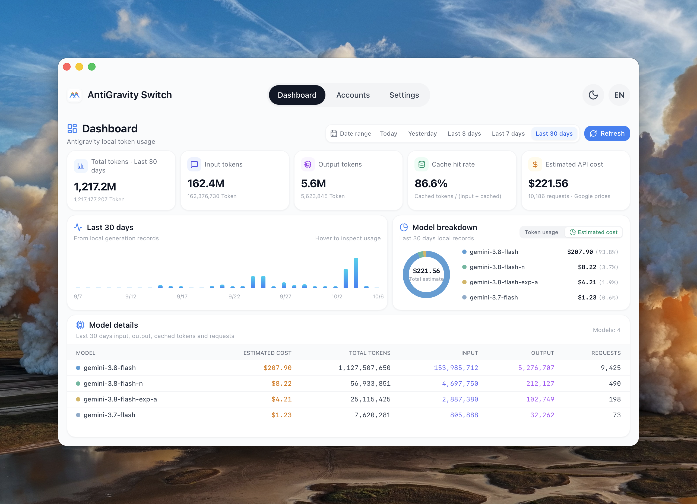
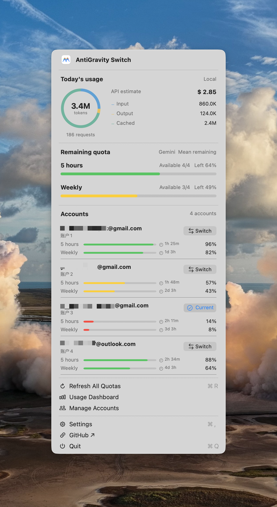
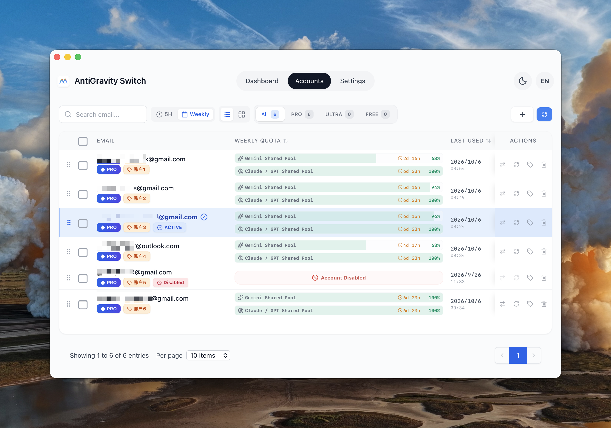
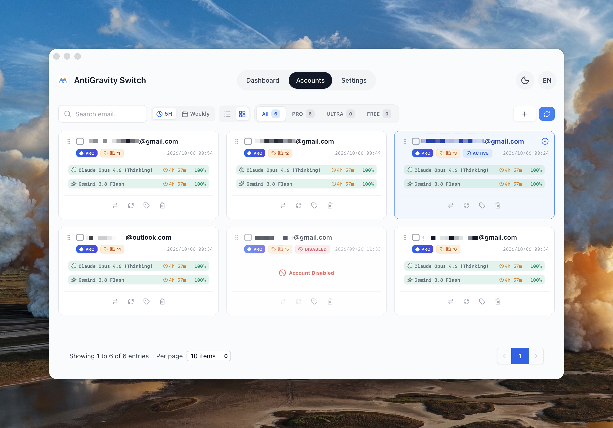
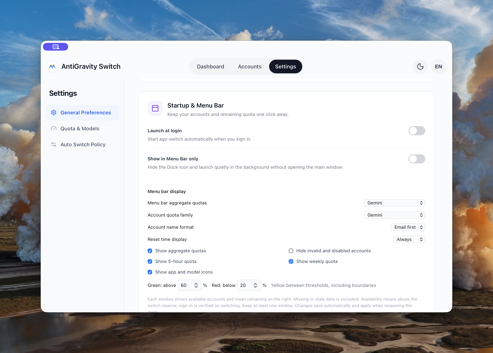
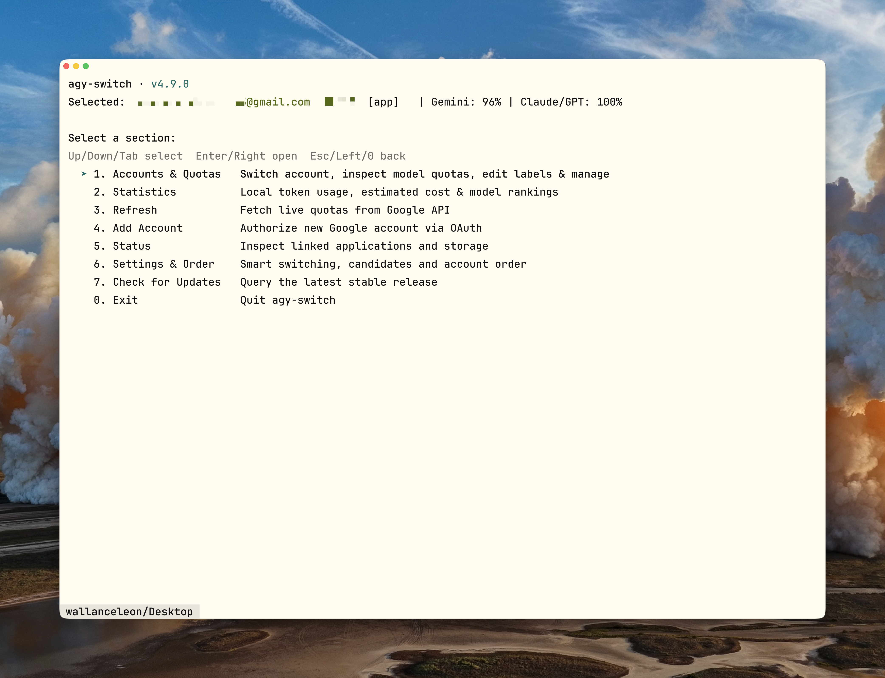

<div align="center">
  
  <h1>AntiGravity Switch</h1>
  <p>Manage your Antigravity accounts, switch accounts, and keep track of usage.</p>
  <p><a href="README.zh-CN.md">简体中文</a> · <a href="#installation">Install</a> · <a href="https://github.com/anglee0323/agy-switch/releases/latest">Download</a> · <a href="docs/cli.md">CLI guide</a></p>
</div>

## What it does

AntiGravity Switch brings your Antigravity accounts into one place. See which accounts have quota left, choose the one you want to use, and review token usage recorded on your machine. Use the desktop app, the menu bar or system tray, or the terminal—all share the same saved accounts.

- **Manage accounts:** add accounts, check quotas and reset times, edit remarks, reorder accounts, and disable unavailable ones.
- **Switch quickly:** select an account from the app or quick dashboard. Optional smart switching selects a backup account when quota runs low.
- **Understand usage:** see input, output and cached tokens, usage trends, and estimated API costs by model.
- **Work from the terminal:** manage accounts, edit switching policies, sort candidates, and check for updates with keyboard controls or commands.

### Supported clients

| Client | What AntiGravity Switch synchronizes |
| --- | --- |
| Antigravity desktop app | The selected account's desktop credentials |
| Antigravity CLI (`agy`) | The native CLI session alongside desktop credentials; initialize the client first |
| Antigravity IDE | The standalone IDE's account credentials |
| Antigravity extension for VS Code | Extension credentials without restarting the VS Code host |

In smart-switch settings, choose Global Sync, Desktop App & CLI, Antigravity IDE, or VS Code Extension. Install and initialize the clients you use first. Compatibility depends on the installed client version and credential store; switching does not migrate running tasks. The management command `agy-switch` is separate from Google's `agy`.

<table>
  <tr>
    <td width="72%" valign="top"><strong>Usage dashboard</strong><br></td>
    <td width="28%" valign="top"><strong>macOS menu bar</strong><br></td>
  </tr>
</table>

<table>
  <tr>
    <td width="50%" valign="top"><strong>Account list</strong><br></td>
    <td width="50%" valign="top"><strong>Account cards</strong><br></td>
  </tr>
</table>

<table>
  <tr>
    <td width="50%" valign="top"><strong>Settings</strong><br></td>
    <td width="50%" valign="top"><strong>Terminal dashboard</strong><br></td>
  </tr>
</table>

Menu bar usage and quotas are example data. Account remarks retain the language entered by the user. [Screenshot sources](docs/screenshots/2026-10-06/README.md)

## Installation

Download the package for your platform from **[GitHub Releases](https://github.com/anglee0323/agy-switch/releases/latest)**. The current release is **4.9.3**. The application is called AntiGravity Switch; the repository and terminal command are `agy-switch`.

| Platform | Desktop package | Terminal access |
| --- | --- | --- |
| macOS · Apple Silicon | Homebrew or macOS ARM64 ZIP | Included with Homebrew |
| Windows · x64 | Windows x64 installer | Included in the installer; separate console ZIP available |
| Linux · x64 | Linux AMD64 deb | Included in the deb; separate console tarball available |

Intel Mac, Windows ARM and Linux ARM packages are not currently provided. Linux desktop packages use Ubuntu 22.04 as the build baseline. The Linux CLI runs without a display but still requires GTK3/WebKitGTK runtime libraries.

### macOS

Install the app and CLI with Homebrew:

```sh
brew tap anglee0323/agy-switch https://github.com/anglee0323/agy-switch.git
brew install --cask anglee0323/agy-switch/agy-switch
```

Alternatively, download the **macOS ARM64 ZIP**, unzip it, and move the app into Applications. [Homebrew installation and upgrades](docs/homebrew.md)

### Windows

Download and run the **Windows x64 installer** (`agy-switch-<version>-windows-x64-setup.exe`). It supports English and Simplified Chinese and installs for the current user.

For terminal use only, extract the **Windows x64 console ZIP**, open PowerShell in that folder, and run:

```powershell
.\agy-switch.exe
```

[Windows installation and troubleshooting](docs/windows.md)

### Linux

Download the **Linux AMD64 deb**, then install it using the actual filename:

```sh
sudo apt install ./agy-switch-4.9.3-linux-amd64.deb
agy-switch-desktop       # desktop app
agy-switch              # terminal dashboard
```

For terminal use only, download the **Linux AMD64 console tarball**. Desktop tray support depends on your desktop environment. [Linux dependencies and setup](docs/linux.md)

**System trust checks:** the current macOS release has no Developer ID signing or notarization, and the Windows installer has no Authenticode signing. Your system may block launch or display security prompts. Homebrew does not bypass these checks. Package SHA-256 values are listed in the release manifest; update signatures are included in the update feed. [Package verification and current limitations](docs/maintainers/4.9.3-public-acceptance.md)

## First use

1. **Add an account** — Open Accounts and choose the add button. Use Google authorization, a refresh token, or a local import. The terminal dashboard also supports authorization and masked token entry.
2. **Refresh quotas** — Check each account's remaining quota and reset time before choosing one.
3. **Switch accounts** — Save your work in Antigravity, then select Switch. Switching may close and reopen the client. Confirm the active account in Antigravity afterward.
4. **Set your preferences** — In Settings, choose your language, theme and quick-dashboard display. Enable smart switching if you want automatic backup selection; it is off by default.

## Everyday use

| To… | Go to… |
| --- | --- |
| Check recent usage or model costs | Dashboard; choose a date range and Token usage or Estimated cost |
| Check recent first-text latency and body output speed | Dashboard; medians from up to 10 local text responses across models and desktop/CLI, with sample count ([details](docs/response-performance.md)) |
| Choose and reorder homepage summary cards | Settings > General > Dashboard cards; selections and drag order save automatically |
| Compare five-hour and weekly quotas | Accounts; choose the quota window and list or card view |
| Set account remarks or change account order | Accounts; edit a remark or drag an account into position |
| Check quotas and switch without the main window | macOS menu bar, or Windows/Linux tray dashboard |
| Choose which model families the quick dashboard shows | Settings; Gemini, Claude/GPT, or both |
| Show reset countdowns | Settings; on hover, always visible, or hidden |
| Configure automatic switching | Settings; choose switch timing, account selection order, thresholds and backup candidates |

Smart switching has two separate choices: **when to switch** (wait for inactivity or act at the threshold), and **which account to choose** (priority order or round robin). Reorder backup candidates to suit your workflow. The background scheduler runs in the desktop app; CLI settings change the same policy but do not start a scheduler.

## Terminal use

Run `agy-switch` without arguments for the interactive dashboard. Use ↑/↓ or Tab to select, Enter/→ to open, and Esc/← to return. The settings editor uses Space to select candidates and Shift+↑/↓ to reorder them.

```sh
agy-switch                       # interactive dashboard
agy-switch accounts list         # saved accounts
agy-switch quota                 # cached quota for the selected account
agy-switch stats                 # local usage and estimated cost
agy-switch refresh               # fetch current quotas
agy-switch switch user@example.com
agy-switch policy show --json    # switching policy
agy-switch update check          # check for a newer release
```

Use the console executable as `.\agy-switch.exe` in PowerShell. Read commands use local caches; use `refresh` for current quotas. JSON output, policy editing, sorting commands and exit codes are covered in the [CLI guide](docs/cli.md).

`agy-switch` manages accounts. Google's `agy` runs Antigravity tasks. A switch also synchronizes an initialized native `agy` session; start a new invocation afterward because an existing task may retain its previous credentials.

## Quotas, costs and updates

### Quota readings

They are the remaining quota reported for each account and window. The quick dashboard's aggregate is an equal-weight average of valid account readings, with an available-account count; it is not a combined token balance. Missing or stale readings are shown as unknown. By default, bars are green above 60%, yellow from 20–60%, and red below 20%.

### Cost estimates

The estimate covers the API-equivalent cost of recorded usage using known model prices. Unpriced models are marked explicitly and excluded from the estimated total. The desktop app refreshes its pricing cache; CLI reads use that local cache. [Usage and quota details](docs/menu-bar-dashboard.md)

### Running tasks

Save your work before switching. Tasks already in progress stay with their original session. Smart switching can check for recent activity, but cannot guarantee every task has finished or migrate a running task. If a switch fails, inspect the client before retrying because credentials may have been partially updated. [Switching behavior](docs/low-quota-switching.md)

### Updates

In the app, check for updates and choose **Download and install** when available. Platform permissions and trust checks still apply. From 4.9.1, a Mac installation that fails system trust checks opens the release page before downloading and requires a manual update. Unattended Mac installation remains blocked by the signing limitation described above. Homebrew users can update through:

```sh
brew update
brew upgrade --cask anglee0323/agy-switch/agy-switch
```

The CLI checks for updates but does not install them. [Update behavior by platform](docs/software-updates.md)

### Local data

Accounts and preferences are stored in `~/.antigravity_tools`. Set `ABV_DATA_DIR` to use another location, and use the same value for the app and CLI. Credentials are sensitive local files. Usage is read from local Antigravity databases and archives; conversation content is not uploaded. Google authorization and quota requests, pricing synchronization and update checks use the network. The project does not operate a credential relay.

## Further reading and development

[CLI reference](docs/cli.md) · [macOS/Homebrew](docs/homebrew.md) · [Windows](docs/windows.md) · [Linux](docs/linux.md) · [Platform validation](docs/maintainers/native-gui-acceptance.md) · [Release checklist](docs/maintainers/release-checklist.md)

To build from source, use Node.js 22+, Rust stable and the dependencies in your platform guide:

```sh
npm ci
npm run tauri dev
```

Use `npm run tauri build` on macOS, `./scripts/build-windows.ps1` on Windows, or `./scripts/build-linux-deb.sh --native` / `--docker` on Linux. Native-window, CLI and package validation records are linked above; a successful build alone does not establish every real-account or desktop integration scenario.

Derived from [lbjlaq/Antigravity-Manager](https://github.com/lbjlaq/Antigravity-Manager). Licensed under [CC BY-NC-SA 4.0](LICENSE).

## Community

[LINUX DO](https://linux.do)
