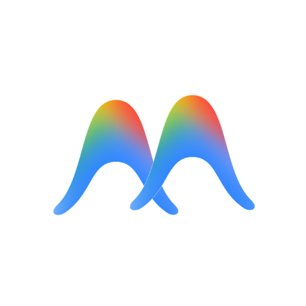
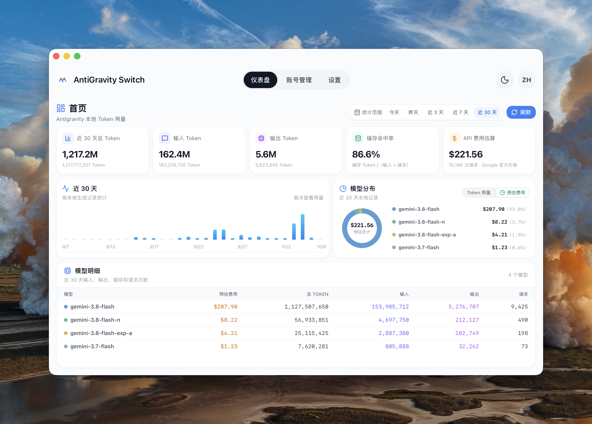
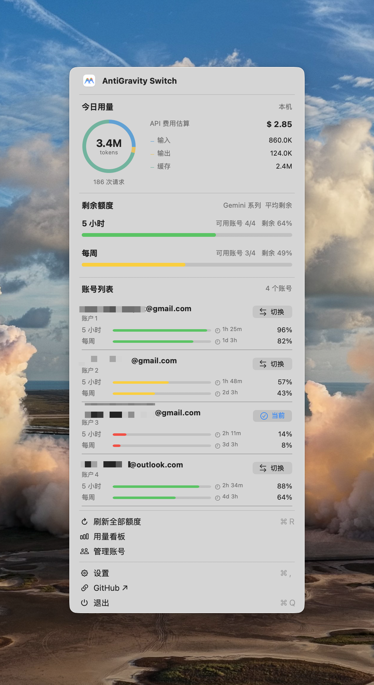
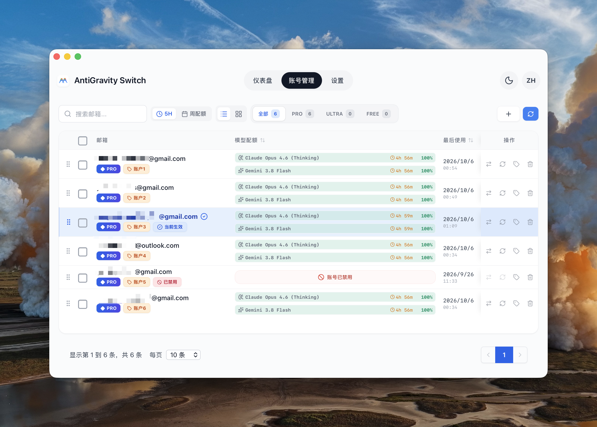
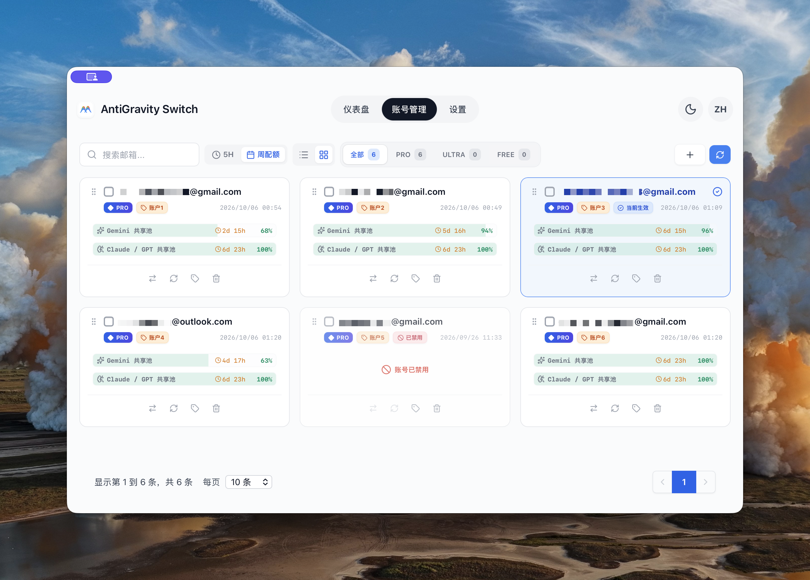
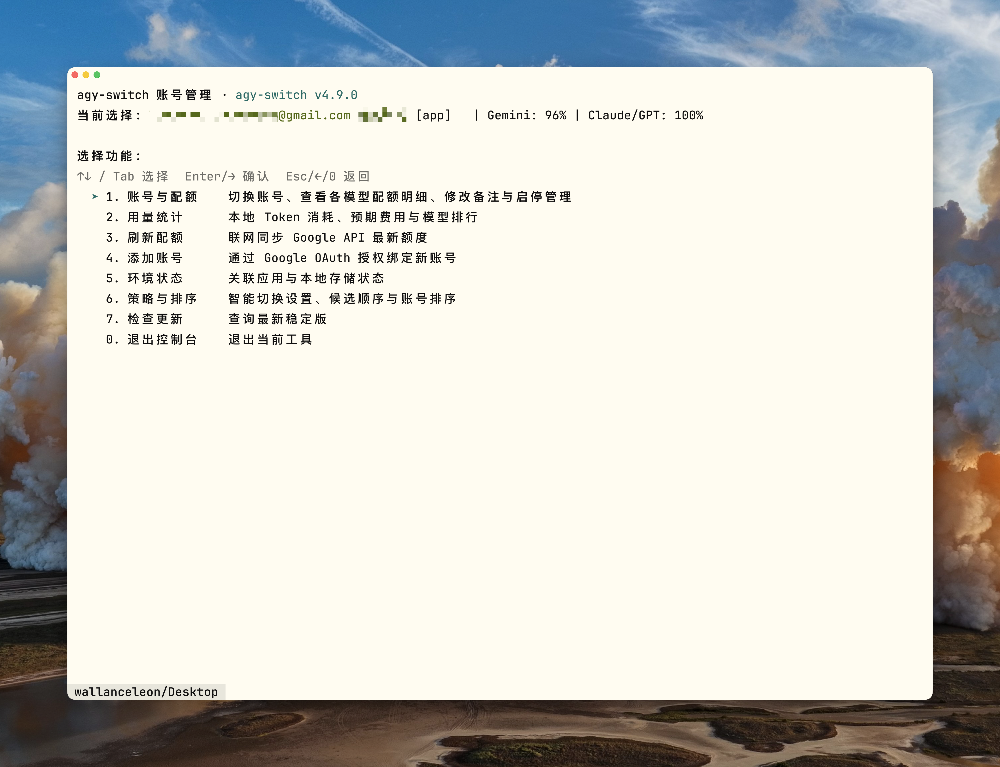

<div align="center">
  
  <h1>AntiGravity Switch</h1>
  <p>集中管理 Antigravity 账号，快捷切换，随时查看额度和用量。</p>
  <p><a href="README.md">English</a> · <a href="#安装">安装方法</a> · <a href="https://github.com/anglee0323/agy-switch/releases/latest">下载</a> · <a href="docs/cli.md">命令行指南</a></p>
</div>

## 能做什么

AntiGravity Switch 把你的 Antigravity 账号集中到一个地方：查看哪个账号还有额度，切换到需要的账号，再了解本机记录的 Token 用量。桌面应用、菜单栏或托盘、命令行共用同一份账号数据，可以按自己的习惯选择入口。

- **管理账号：** 添加账号，查看额度和重置时间，修改备注，调整顺序，禁用不可用的账号。
- **快捷切换：** 在应用或快捷看板中选择账号；也可以启用智能切换，在额度不足时选择备用账号。
- **查看用量：** 了解输入、输出、缓存 Token 的构成，查看用量趋势和各模型的 API 费用估算。
- **终端操作：** 用键盘或命令管理账号，设置切换策略，调整候选顺序，检查更新。

### 支持的客户端

| 客户端 | 同步内容 |
| --- | --- |
| Antigravity 桌面客户端 | 当前选择账号的桌面凭据 |
| Antigravity 命令行（`agy`） | 随桌面凭据一起同步原生命令行会话，需要先初始化客户端 |
| Antigravity IDE | 独立 IDE 的账号凭据 |
| VS Code 中的 Antigravity 插件 | 插件凭据，无需重启 VS Code 主编辑器 |

智能切换设置可选择全域同步、桌面客户端与命令行、Antigravity IDE 或 VS Code 插件。请先安装并初始化需要使用的客户端。兼容性取决于客户端版本和凭据存储方式；切换不会迁移正在运行的任务。本工具的管理命令 `agy-switch` 与 Google 的 `agy` 是两个不同的命令。

<table>
  <tr>
    <td width="72%" valign="top"><strong>用量首页</strong><br></td>
    <td width="28%" valign="top"><strong>macOS 菜单栏</strong><br></td>
  </tr>
</table>

<table>
  <tr>
    <td width="50%" valign="top"><strong>账号列表</strong><br></td>
    <td width="50%" valign="top"><strong>账号卡片</strong><br></td>
  </tr>
</table>

**命令行看板**



菜单栏的用量和额度为展示用示例数据，账号备注保留用户输入的语言。[截图来源](docs/screenshots/2026-10-06/README.md)

## 安装

从 **[GitHub Releases](https://github.com/anglee0323/agy-switch/releases/latest)** 下载对应平台的安装包，当前版本为 **4.9.0**。应用全名是 AntiGravity Switch，仓库和命令行使用 `agy-switch`。

| 平台 | 桌面安装方式 | 命令行入口 |
| --- | --- | --- |
| macOS · Apple Silicon | Homebrew 或 macOS ARM64 ZIP | Homebrew 安装自带 |
| Windows · x64 | Windows x64 安装程序 | 安装程序自带，也可单独下载命令行 ZIP |
| Linux · x64 | Linux AMD64 deb | deb 自带，也可单独下载命令行 tar.gz |

目前不提供 Intel Mac、Windows ARM 和 Linux ARM 安装包。Linux 桌面包以 Ubuntu 22.04 为构建基线；命令行无需显示环境，但仍需要 GTK3/WebKitGTK 运行库。

### macOS

通过 Homebrew 同时安装应用和命令行：

```sh
brew tap anglee0323/agy-switch https://github.com/anglee0323/agy-switch.git
brew install --cask anglee0323/agy-switch/agy-switch
```

也可以下载 **macOS ARM64 ZIP**，解压后将应用移入 Applications（应用程序）目录。[Homebrew 安装与升级](docs/homebrew.md)

### Windows

下载并运行 **Windows x64 安装程序**（`agy-switch-<版本>-windows-x64-setup.exe`）。安装程序支持中文和英文，安装到当前用户目录。

如果只用命令行，解压 **Windows x64 命令行 ZIP**，在该目录打开 PowerShell：

```powershell
.\agy-switch.exe
```

[Windows 安装与故障排查](docs/windows.md)

### Linux

下载 **Linux AMD64 deb**，使用实际文件名安装：

```sh
sudo apt install ./agy-switch-4.9.0-linux-amd64.deb
agy-switch-desktop       # 桌面应用
agy-switch              # 命令行看板
```

如果只用命令行，可以下载 **Linux AMD64 命令行 tar.gz**。桌面托盘是否可用取决于桌面环境。[Linux 依赖与安装](docs/linux.md)

**系统信任检查：** 当前 macOS 安装包尚无 Developer ID 签名和公证，Windows 安装程序尚无 Authenticode 签名，系统可能阻止启动或提示安全确认。Homebrew 不会绕过这些检查。发布清单列出安装包的 SHA-256，更新源包含更新签名。[安装包验证与当前限制](docs/maintainers/4.9.0-public-acceptance.md)

## 第一次使用

1. **添加账号**：打开账号管理，点击添加按钮，通过 Google 授权、刷新令牌或本机导入添加账号。命令行看板也支持授权和遮罩输入令牌。
2. **刷新额度**：查看各账号的剩余额度和重置时间，选择准备使用的账号。
3. **切换账号**：先保存 Antigravity 中的工作，再点击切换。切换可能关闭并重新打开客户端，完成后请在 Antigravity 中确认当前账号。
4. **调整偏好**：在设置中选择语言、主题和快捷看板的显示方式。如果需要自动选择备用账号，可以开启智能切换；它默认关闭。

## 日常操作

| 想做什么 | 在哪里操作 |
| --- | --- |
| 查看近期用量和模型费用 | 首页，选择统计范围，再切换 Token 用量或预估费用 |
| 比较 5 小时和每周额度 | 账号管理，选择额度周期及列表或卡片视图 |
| 修改账号备注或调整顺序 | 账号管理，编辑备注或拖动账号排序 |
| 不打开主窗口就查看额度和切换 | macOS 菜单栏，或 Windows/Linux 托盘看板 |
| 选择快捷看板显示的模型系列 | 设置，选择 Gemini、Claude/GPT 或两组系列 |
| 显示重置倒计时 | 设置，选择悬浮显示、始终显示或隐藏 |
| 自动选择备用账号 | 设置，配置切换时机、选择顺序、额度阈值和候选账号 |

智能切换分为两个独立选项：**什么时候切换**（检测空闲后切换，或达到阈值后切换），以及**按什么顺序选账号**（优先顺序，或循环轮换）。候选账号可以排序。后台策略由桌面应用执行；命令行修改的是同一份策略，但不会启动后台调度程序。

## 命令行使用

直接运行 `agy-switch`，即可打开交互看板。上下方向键或 Tab 选择，回车或右方向键进入，Esc 或左方向键返回。在策略编辑中，空格选择候选账号，Shift 加上下方向键调整顺序。

```sh
agy-switch                       # 打开交互看板
agy-switch accounts list         # 查看已保存的账号
agy-switch quota                 # 查看当前选择账号的缓存额度
agy-switch stats                 # 查看本机用量和费用估算
agy-switch refresh               # 联网刷新额度
agy-switch switch user@example.com
agy-switch policy show --json    # 查看切换策略
agy-switch update check          # 检查是否有新版本
```

PowerShell 中使用 `.\agy-switch.exe`。只读命令使用本机缓存，需要最新额度时执行 `refresh`。JSON 输出、策略编辑、排序命令和退出码见[命令行指南](docs/cli.md)。

`agy-switch` 用于管理账号，Google 的 `agy` 用于执行 Antigravity 任务。切换也会同步已初始化的原生 `agy` 会话；切换后请启动新的任务，已经运行的任务可能仍使用之前的凭据。

## 额度、费用与更新

### 额度数据

表示各账号在对应周期的剩余额度。快捷看板的整体额度是有效账号数据的等权平均值，同时显示可用账号数，不是可相加的 Token 总量。数据缺失或过期时显示为未知。额度条默认在大于 60% 时为绿色、20% 至 60% 时为黄色、低于 20% 时为红色。

### 费用估算

费用估算根据已知模型价格，计算本机用量按 API 计费时对应的费用，不是实际订阅账单。无法计价的模型会明确标识，不计入预估合计。桌面应用会刷新价格缓存，命令行读取本机缓存。[用量与额度说明](docs/menu-bar-dashboard.md)

### 运行中的任务

切换前请保存工作，已运行的任务仍属于原来的会话。智能切换可以检查近期活动，但不能保证所有任务已结束，也不会迁移正在运行的任务。切换失败时，请先确认客户端状态再重试，因为部分凭据可能已经更新。[切换机制](docs/low-quota-switching.md)

### 更新

在应用中检查更新，有新版本时选择**下载并安装**。安装仍受系统权限和信任检查限制；目前 Mac 的无感安装受上述签名问题限制。Homebrew 用户也可以执行：

```sh
brew update
brew upgrade --cask anglee0323/agy-switch/agy-switch
```

命令行只检查更新，不执行安装。[各平台更新方式](docs/software-updates.md)

### 本机数据

账号和偏好默认保存在 `~/.antigravity_tools`。如需更换目录，可设置 `ABV_DATA_DIR`，应用和命令行应使用相同的值。凭据属于敏感本地文件。用量来自 Antigravity 本机数据库和归档，应用不会上传对话内容。Google 授权和额度查询、价格同步、更新检查需要联网；本项目不提供凭据中转服务。

## 更多文档与开发

[命令行参考](docs/cli.md) · [macOS/Homebrew](docs/homebrew.md) · [Windows](docs/windows.md) · [Linux](docs/linux.md) · [平台验证记录](docs/maintainers/native-gui-acceptance.md) · [发布检查清单](docs/maintainers/release-checklist.md)

从源码运行需要 Node.js 22+、Rust stable，以及平台指南中列出的依赖：

```sh
npm ci
npm run tauri dev
```

macOS 使用 `npm run tauri build`，Windows 使用 `./scripts/build-windows.ps1`，Linux 使用 `./scripts/build-linux-deb.sh --native` 或 `--docker`。原生窗口、命令行和安装包的验证记录见上方链接；构建成功不代表所有真实账号操作和桌面集成场景均已验证。

基于 [lbjlaq/Antigravity-Manager](https://github.com/lbjlaq/Antigravity-Manager) 衍生，采用 [CC BY-NC-SA 4.0](LICENSE) 许可。
