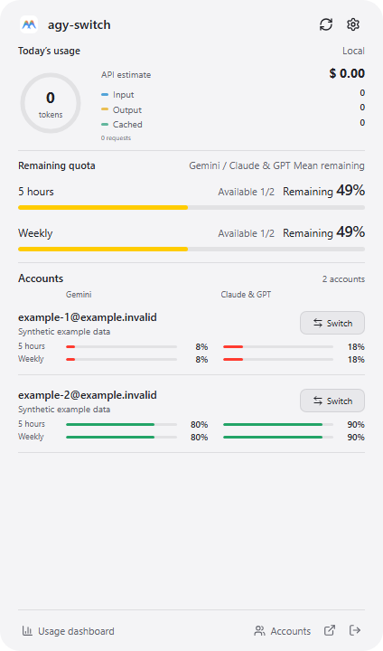

# Windows delivery

agy-switch ships a per-user x64 desktop installer and a separate console download. The desktop app uses WebView2; `agy-switch.exe` starts the CLI before any desktop initialization. Both use the same account data.

## Install and run

From 4.9.0, the packages name the app `agy-switch` and the GUI executable `agy-switch-desktop.exe`. Public 4.8.1 downloads retain their original app/installer names.

Use the NSIS `windows-x64-setup.exe` from the release page. Choose English or Simplified Chinese in the installer. It installs the desktop executable and `agy-switch.exe` into the selected directory. The CLI can also be extracted from `agy-switch-<version>-windows-x64.zip` without installing the app.

Open PowerShell in the installation/extraction directory:

```powershell
.\agy-switch.exe
.\agy-switch.exe --version
$accounts = .\agy-switch.exe accounts list --json | ConvertFrom-Json
$LASTEXITCODE
```

To use the name without a path, add the chosen folder to your user PATH through Windows Environment Variables, then open a new terminal. The installer does not overwrite another `agy` command or silently modify PATH.

The console executable has the Windows console subsystem, so PowerShell waits for it and receives its exit code. The separate desktop executable retains the GUI subsystem and opens without an extra console. Prefer the console executable for terminal scripts.

## Desktop parity

The main app provides the same accounts, usage, smart-switch strategy/order, update notices and preferences as Mac. The tray dashboard uses the same three sections and settings, rendered as an opaque compact WebView with the system UI font. Switch controls have hover/focus feedback; saved/disabled labels use the same dimensions and distinct status colors. A saved selection is labelled Saved and can be reapplied; it is not proof of live login. Account identity labels do not open a redundant second window.

The panel is prepared while hidden, reused across opens and clamped to the monitor work area. Escape and focus loss dismiss it. Missing tray support preserves access to the main window. Native Mac menu materials are specific to AppKit; no transparent glass overlay is used on Windows.



Actual Windows WebView2 viewport, CI debug build with synthetic quota observations. This is a compact-route capture, not a tray-placement test. [Source and hashes](screenshots/4.9.0/README.md)

WebView2 is required for the desktop app. Tauri’s NSIS installer handles the configured runtime bootstrapper when needed. The console’s read commands do not initialize WebView2. Downloaded executables are currently not Authenticode signed; SmartScreen or enterprise policies may block them. This project does not change those policies.

## Data and switching

`dirs` resolves Windows Known Folders. The default account store is `.antigravity_tools` under the user profile; `ABV_DATA_DIR` overrides the Tools data store. Changing `HOME` or `APPDATA` does not generally change Windows Known Folders. Native Antigravity/agy credentials use their own platform locations.

Manual switching may close/reopen Antigravity, changes its credential store and synchronizes an initialized native agy session. An external task may retain the previous credential. Verify the active account in the client after switching, especially if a partial update is reported. The CLI’s default APP target requires a discoverable Antigravity installation. No file-only target is offered.

## Build

Install Node.js 22+, Rust stable, Microsoft C++ Build Tools and the Tauri platform prerequisites. From PowerShell:

```powershell
./scripts/build-windows.ps1
```

This builds both executables before bundling the console program as a resource. Referencing that resource during the first Rust build would create a circular dependency. Installer output is under `src-tauri/target/release/bundle/nsis/`.

## Verification boundaries

CI separately exercises JSON/exit codes, a real ConPTY terminal, the actual NSIS installer, and native WebView2 windows with synthetic accounts. The native GUI test build explicitly enables `native-gui-test`; only debug Windows builds can pass a WebDriver port through the WebView2 API. Production builds cannot use this path. It addresses [the elevated WebView2 automation restriction](https://github.com/tauri-apps/wry/issues/1782) without registry changes or disabling OS security.

Hosted Windows CI is not a substitute for every physical Windows 10/11 device, display arrangement, startup registration, real Google login or authenticated switching. Exact outcomes and source commits belong in [native acceptance](maintainers/native-gui-acceptance.md), [4.10.0 package verification](maintainers/4.10.0-public-acceptance.md) and release notes.
